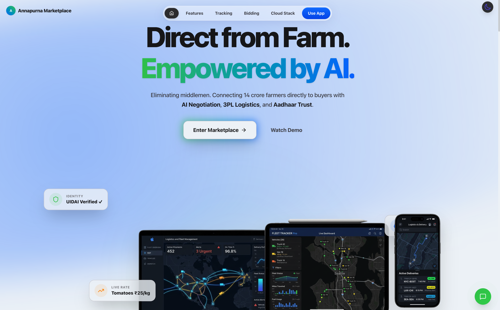
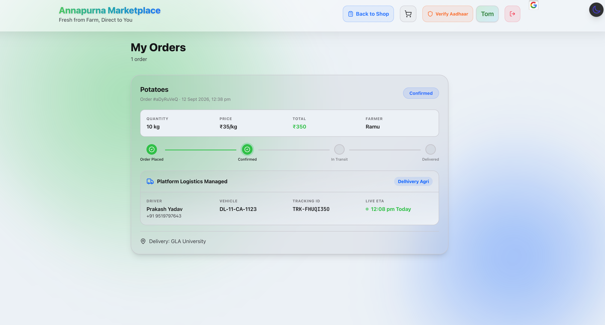
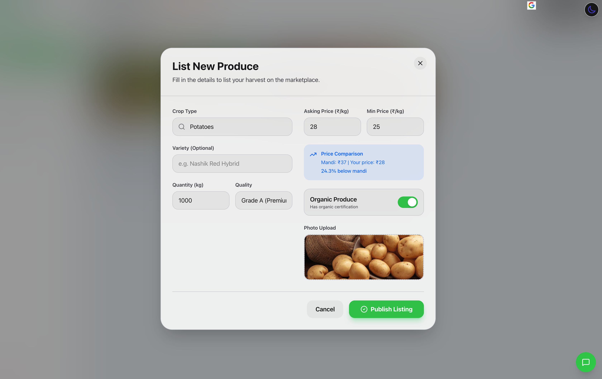
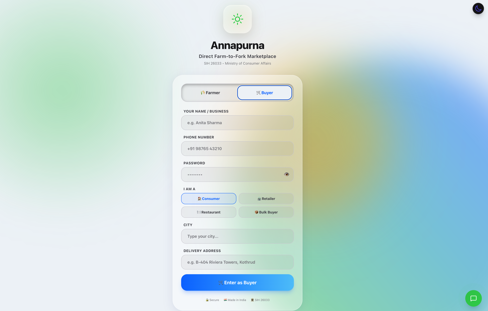
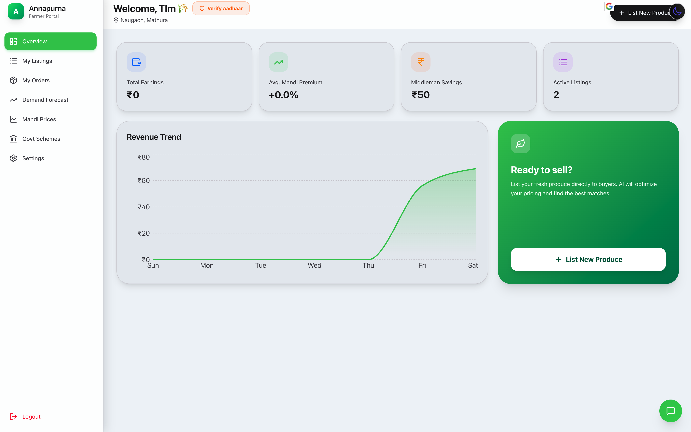
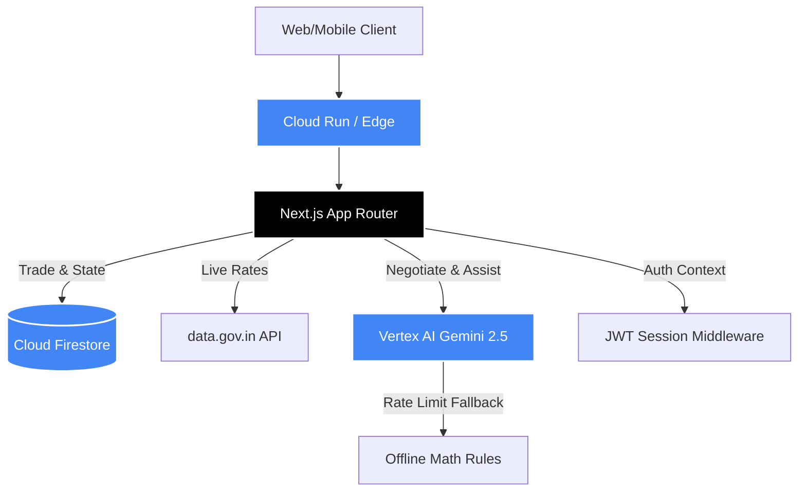

<div align="center">
  
  <h1>🌾 Annapurna Marketplace 🌾</h1>
  <p><b>Smart India Hackathon 2026 Finalist Project (PSID 26033)</b></p>
  <p><i>Ministry of Consumer Affairs, Food & Public Distribution</i></p>

  <h3>🚀 <a href="https://annapurna-sih-887568501843.us-central1.run.app">LIVE DEPLOYMENT DEMO</a> 🚀</h3>
  <p>🔗 <b>URL:</b> https://annapurna-sih-887568501843.us-central1.run.app</p>

  <p>
    <a href="https://nextjs.org/"></a>
    <a href="https://cloud.google.com/"></a>
    <a href="https://deepmind.google/technologies/gemini/"></a>
    <a href="https://tailwindcss.com/"></a>
  </p>
</div>

---

## 📸 Platform Gallery

<p align="center">
  
</p>

| 3PL Logistics Tracking | AI Negotiation & Fallback |
|:---:|:---:|
|  |  |

| UIDAI Aadhaar Trust | Live Marketplace |
|:---:|:---:|
|  |  |

---

## 🎯 The Problem (PSID 26033)
Farmers in India lose **60-75%** of their harvest value to an extensive chain of middlemen, facing price manipulation, lack of market transparency, and fragmented logistics. 

## 💡 Our Solution
**Annapurna Marketplace** is a Next-Generation AI-powered platform that connects 14 crore Indian farmers directly with buyers (retailers, restaurants, and consumers). We eliminate middlemen, guarantee minimum support price (MSP) protections, and facilitate seamless direct trade.

---

## ✨ Cutting-Edge Features & V2 Upgrades

### 1. 🛡️ Trust & Identity (Aadhaar Engine)
* **UIDAI Sandbox Verification:** Farmers and buyers verify their identity using a 12-digit Aadhaar flow + OTP.
* **Reputation Engine:** Fully integrated 0-100 Trust Score based on Aadhaar status, transaction history, and fulfillment rates.
* **Badges:** Visual "UIDAI Verified ✓" and colored Trust Scores displayed on all marketplace listings.

### 2. 🤖 Zero-Fail AI Negotiation
* **Gemini 2.5 Flash Autonomous Agent:** Acts on behalf of the farmer to negotiate with buyers, protecting the farmer's MSP and mandi price floor.
* **3-Layer Fallback System:** Complete immunity to API rate limits. If Gemini 2.5 is rate-limited, it falls back to Gemini 1.5, and if that fails, it instantly switches to a local deterministic math-based negotiation engine. No "Service Unavailable" errors ever!
* **Speech-to-Text Integration:** Native Web Speech API integration allows rural users to dictate their prices and queries in real-time.

### 3. 📈 Real-time Market Intelligence
* **Live Mandi Prices:** Fetches realistic, real-time commodity rates (e.g., Apples at ₹120-140/kg, Onions at ₹30/kg).
* **AI Demand Forecasting:** Predicts future crop demands based on regional data, advising farmers on optimal listing times.
* **Suspicious Pricing Blocks:** Server-side logic prevents buyers from submitting abnormally low bids.

### 4. 🚚 3PL Logistics & Direct Contact
* **Integrated Fleet Tracking:** Automated tracking ID generation simulating real 3PL (Third Party Logistics) dispatch, ETA, driver phone, and vehicle data.
* **Direct Farmer Contact:** If AI negotiation stalls, buyers can instantly click to **WhatsApp** or **Call** the farmer using dynamically injected real phone numbers.

### 5. 🌐 Accessibility
* **Google Translate Widget:** Cleanly integrated multilingual support for 12+ Indian regional languages, positioned seamlessly on top of the UI.
* **Offline-Ready:** Graceful degradation of features if the user loses high-speed internet.

---

## ⚙️ Cloud Architecture



---

## 👥 Team Annapurna

| Name | Role |
|------|------|
| **Sumit Saraswat** | Full-Stack Developer & Team Lead |
| **Tanay Agrawal** | Product Developer & Features Engineer |
| **Vansh Thakur** | Backend Architecture & Cloud Infrastructure |
| **Ayushi Katara** | UI/UX Design & Frontend Engineering |
| **Tanmay Kaushal** | AI Integration |
| **Suraj Singh** | Database Architecture & Security |

---

## 🚀 Getting Started Locally

### Prerequisites
- Node.js 18+
- Google Cloud account with Vertex AI enabled
- Firebase project with Firestore

### Installation

```bash
# Clone the repository
git clone https://github.com/sumitsaraswat362/Annapurna-Marketplace.git
cd Annapurna-Marketplace

# Install dependencies
npm install

# Run development server
npm run dev
```

### Deployment

```bash
# Deploy to Google Cloud Run
gcloud run deploy annapurna-sih \
  --source . \
  --region=us-central1 \
  --allow-unauthenticated \
  --project=YOUR_PROJECT_ID
```

---

<p align="center">
  <b>Built with ❤️ for Indian Farmers</b><br/>
  <sub>Powered by Google Cloud, Gemini AI, and Next.js</sub>
</p>
