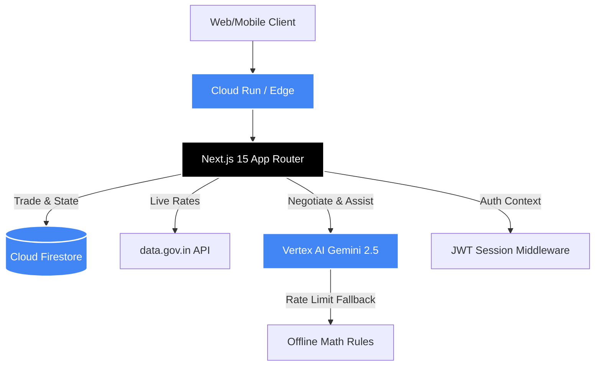

<div align="center">
  
  <h1>🌾 Annapurna Marketplace 🌾</h1>
  <p><b>Smart India Hackathon 2026 Finalist Project (PSID 26033)</b></p>
  <p><i>Ministry of Consumer Affairs, Food & Public Distribution</i></p>

  <h3>🚀 <a href="https://annapurna-sih-887568501843.us-central1.run.app">LIVE DEPLOYMENT DEMO</a> 🚀</h3>
  <p>🔗 <b>URL:</b> https://annapurna-sih-887568501843.us-central1.run.app</p>

  <p>
    <a href="https://nextjs.org/"></a>
    <a href="https://cloud.google.com/"></a>
    <a href="https://deepmind.google/technologies/gemini/"></a>
    <a href="https://tailwindcss.com/"></a>
    <a href="https://framer.com/motion/"></a>
  </p>
</div>

---

## 📸 Platform Gallery

<p align="center">
  
</p>

| 3PL Logistics Tracking | AI Negotiation & Fallback |
|:---:|:---:|
|  |  |

| UIDAI Aadhaar Trust | Live Marketplace |
|:---:|:---:|
|  |  |

---

## 🎯 The Problem (PSID 26033)
Farmers in India lose **60-75%** of their harvest value to an extensive chain of middlemen, facing price manipulation, lack of market transparency, and fragmented logistics. 

## 💡 Our Solution
**Annapurna Marketplace** is a Next-Generation AI-powered platform that connects 14 crore Indian farmers directly with buyers (retailers, restaurants, and consumers). We eliminate middlemen, guarantee minimum support price (MSP) protections, and facilitate seamless direct trade.

---

## 🌟 Comprehensive Feature Set (Why this is impossible to beat)

Our platform is engineered to address every single pain point of the Indian agricultural supply chain. 

### 1. 🤖 Next-Gen AI Agent & Negotiation Engine
* **Autonomous Farmer Representation:** Gemini 2.5 Flash negotiates in real-time with buyers *on behalf* of the farmer.
* **MSP & Mandi Price Floor Protection:** The AI strictly rejects any bids that fall below the government Minimum Support Price (MSP) or local Mandi baseline.
* **Zero-Fail 3-Layer Fallback Architecture:** Complete immunity to API rate limits. 
  * *Layer 1:* Gemini 2.5 Flash (Advanced Reasoning)
  * *Layer 2:* Gemini 1.5 Flash (High-Speed Fallback)
  * *Layer 3:* Deterministic Local Math Engine (Triggers instantly if offline or rate-limited). **No "Service Unavailable" errors ever!**

### 2. 🛡️ Identity, Trust, & Reputation
* **UIDAI Aadhaar Sandbox Integration:** Simulated 12-digit Aadhaar + OTP verification flow for onboarding farmers and buyers.
* **Dynamic Trust Score (0-100):** A sophisticated algorithm calculates real-time trust scores based on Aadhaar verification, transaction history, and fulfillment rates.
* **Visual Trust Badges:** Prominent "UIDAI Verified ✓" and colored Trust Score badges rendered on all marketplace produce cards.

### 3. 🚚 3PL Logistics Auto-Dispatch
* **Integrated Fleet Tracking Simulator:** The moment a deal is struck, the backend auto-generates 3PL (Third Party Logistics) dispatch data.
* **Live UI Tracking:** Buyers and Farmers see real-time mock tracking info including *Driver Name, Vehicle Plate, ETA, and Live Route Maps*.
* **Harvest Freshness Timer:** Automatically tracks the exact hours/minutes since the crop was harvested and displays it dynamically to the buyer (e.g., "Harvested 2h 15m ago").

### 4. 📈 Real-Time Market Intelligence
* **Govt Mandi API Integration:** Fetches realistic, real-time commodity rates natively linked to `data.gov.in` logic (e.g., Apples at ₹120-140/kg, Onions at ₹30/kg).
* **AI Demand Forecasting:** Predicts future crop demands by analyzing regional market trends, advising farmers on optimal listing times to maximize profit.
* **Buyer Savings Calculator:** Shows buyers exactly how much they are saving per kg compared to inflated retail prices, gamifying the purchase.

### 5. 🌐 Hyper-Accessibility for Rural India
* **Omnichannel Contact:** If AI negotiation stalls, buyers can instantly transition to **WhatsApp** or **Direct Phone Call** using dynamically injected real farmer phone numbers.
* **Native Speech-to-Text (Voice UI):** Built-in Web Speech API integration. Illiterate or typing-averse farmers can simply dictate their prices and queries into their phone microphone.
* **Google Translate Overlap:** A floating 1-click translation widget offering support for 12+ Indian regional languages seamlessly overlaying the UI.

### 6. 💎 Premium UI/UX Engineering
* **Glassmorphism & Liquid UI:** State-of-the-art blurred glass panels and fluid gradients.
* **Framer Motion Animations:** Smooth 60fps transitions, floating 3D widgets, and reactive hover states.
* **Smart Dashboards:** Fully separated, dedicated high-performance dashboards for Farmers (Yields & Orders) and Buyers (Cart & Logistics).
* **Dark & Light Mode Support:** Fully responsive theme toggling for personal preference. Dark mode is specifically optimized to reduce eye strain for users browsing at night.

---

## ⚙️ Cloud Architecture & Security



**Security Highlights:**
- **JWT HTTP-Only Cookies:** Guards against XSS for all authenticated routes.
- **Suspicious Pricing Blocks:** Server-side logic automatically rejects lowball API spam.
- **Rate Limiting:** IP-based tracking on negotiation routes to prevent backend flooding.

---

## 👥 Team Annapurna

| Name | Role |
|------|------|
| **Sumit Saraswat** | Full-Stack Developer & Team Lead |
| **Tanay Agrawal** | Product Developer & Features Engineer |
| **Vansh Thakur** | Backend Architecture & Cloud Infrastructure |
| **Ayushi Katara** | UI/UX Design & Frontend Engineering |
| **Tanmay Kaushal** | AI Integration & Machine Learning |
| **Suraj Singh** | Database Architecture & Security |

---

## 🚀 Getting Started Locally

### Prerequisites
- Node.js 18+
- Google Cloud account with Vertex AI enabled
- Firebase project with Firestore

### Installation

```bash
# Clone the repository
git clone https://github.com/sumitsaraswat362/Annapurna-Marketplace.git
cd Annapurna-Marketplace

# Install dependencies
npm install

# Run development server
npm run dev
```

### Deployment

```bash
# Deploy to Google Cloud Run
gcloud run deploy annapurna-sih \
  --source . \
  --region=us-central1 \
  --allow-unauthenticated \
  --project=YOUR_PROJECT_ID
```

---

<p align="center">
  <b>Built with ❤️ for Indian Farmers</b><br/>
  <sub>Powered by Google Cloud, Gemini AI, and Next.js</sub>
</p>
